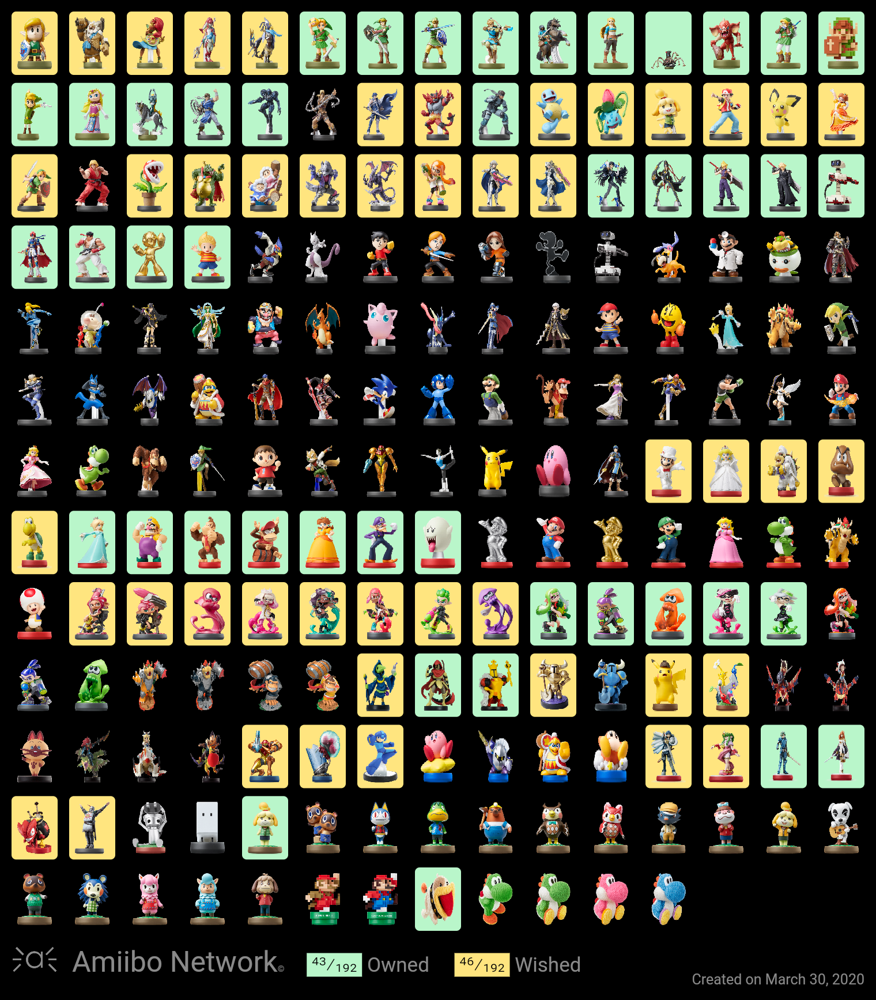
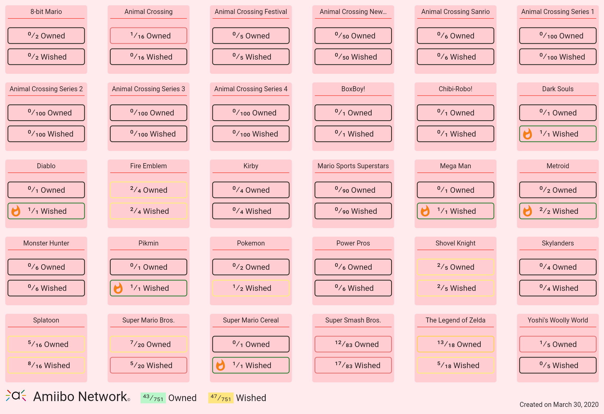
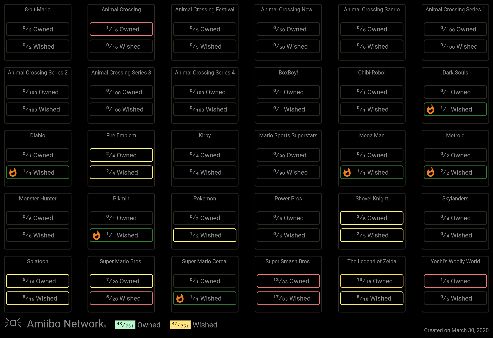

# Amiibo Network 

An Amiibo collection app with a wishlist and personal collection, screenshot mode to save your collection and stats, so you can always show your amazing Amiibo collection!

Features:
- Owned collection and wishlist at top of the screen to always check your stats
- See your stats as you want, percentage or ratio switch button from the drawer
- Tap once on an amiibo to add it to your collection, again to your wished list, and last to remove it.
- Double tap to see the detail of any amiibo, release date, character name, game or add it directly to any list you want from there
- Long tap to start selecting multiple amiibos and add it or remove it of any list you want at once
- Category list drawer to show by All, Owned, Wished, Stats or by amiibo series split by figures and cards
- Personal stats split by All, figures and cards. Take a screenshot of your stat at any time and save it for later as a picture in your download folder
- Search bar improved, so you can search by name, game or amiibo series
- Order the list based on what you think it's more important, the release date of any of the 4 regions, your owned, wished or name
- Auto mode theme (only for some Android 9 and Android 10 devices) or manually select your preferred mode, light or dark
- Multiple light and dark themes to select from the drawer or settings. Tap the theme icon in the drawer to change between light, dark or auto mode or just long press the theme icon to visualize all the themes and select your preferred one or go to settings and select appearance
- Save your collection as a picture in your download folder, reset your collection or import/export your collection data (useful when changing device) all from settings

DISCLAIMER
Amiibo Network is an unofficial app for collectors and fans of amiibo and is intended to be used for informational and educational purposes only.

Amiibo Network is in no way affiliated with Nintendo. amiibo is a registered trademark of Nintendo. All items, names and other aspects are trademarked and owned by their respective owners.

## Screenshots

Light                      |             Dark
:-------------------------:|:-------------------------:
  |  
  |  
  |  
 | 
 | 
 | 

## Getting Started

This project is a starting point for a Flutter application.

A few resources to get you started if this is your first Flutter project:

- [Lab: Write your first Flutter app](https://flutter.dev/docs/get-started/codelab)
- [Cookbook: Useful Flutter samples](https://flutter.dev/docs/cookbook)

For help getting started with Flutter, view our
[online documentation](https://flutter.dev/docs), which offers tutorials,
samples, guidance on mobile development, and a full API reference.
